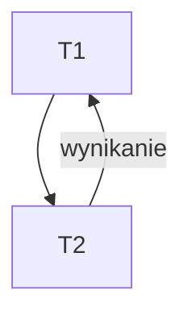

# Poznanie jako główny problem filozofii cz. 2
1. Fakty
2. Hipotezy naukowe
3. Prawa nauki
4. Teorie naukowe
5. koncepcje praw naukowych
6. uzasadnienie praw naukowych

## Fakty
Zdarzenie ujęte w interwale czasowym (w czasoprzestrzeni)

## Hipoteza
przypuszczenie dot. wyjaśnienia

## Prawa nauki
obiektywna i konieczna prawidłowość występująca w rzeczywistości empirycznej

### Formalne warunki:
- uniwersalność - bez względu kiedy i gdzie
- nie równoważność ze zbiorem zdań jednostkowych - 
- otwartość ontologiczna - zdarzeń w przeszłości i zdarzeń w przyszłości
- otwartość epistemologiczna - 

### Nieformalne warunki:
- posiada uzasadnienie - 
- spełnia funkcje ekplanacyjną - 
- przynależy do teorii naukowej - 

### Rodzaje praw nauki
Podziały dychotomiczne praw nauki na:
- jakościowe - ilościowe: charakter funkcyjny
- empiryczne - teoretyczne: rejestrujące
- dynamiczne - systematyczne: 
- synchroniczne - diachroniczne: 
- strukturalne - funkcjonalne: jakie elementy systemu podlegają jakim przekształceniom

### Funkcje praw nauki
- Eksplanacyjna
  Rodzaje eksplantacji:
  - Ontologiczna - wskazanie racji koniecznej i wystarczającej (w ontologii i metafizyce)
  - Funkcjonalne - funkcje matematyczne między faktami
  - Przyczynowe - przyczyna - skutek ujmuje
  - Teleologiczne - odwołujące się do celu zdarzenia
  - Probabilistyczne - 
  - Teoretyczne - wynikają z teorii bez możliwości empirycznego potwierdzenia
- Prognostyczna:
  Nieskończona dziedzina przedmiotowa ( Empiryczna, skończona dziedzina przedmiotowa (Fakty naukowe ( ) ) )
- Prakseologiczna
  

# Teorie naukowe
1. Twierdzenia naukowe - muszą wyjaśniać jakąś klasę zjawisk, zawiera co najmniej 1 termin który denotuje on własność nieobserwowalną
2. Modele odzwierciedlające - badany fragment rzeczywistości
3. Procedurę stosowaną - teorii na skali: weryfikacja - falsyfikacja, czy teoria przysługuje wartość logiczna prawda czy fałsz

## Ciągłość vs. nieciągłość teorii naukowych



T1 - T2
1. Niewspółmierność teorii naukowych
   ```mermaid
	graph TD;
	T1(starsza) -- timeline --> T2(nowsza)
	T2 -- wynikanie --> T1
	```
1. Korespondencjonizm implikacyjny
2. Korespondencjonizm eksplanacyjny
   ```mermaid
	graph TD;
	T1(Fg=ma) -- timeline --> T2("Fg=ma/(1-sqrt(v/c))")
	T2 -- graniczny przypadek --> T1
	```

H. Raichenbach - powstanie filozofii naukowej
 - Kontekst odkrycia - pozametodologiczne 
 - Kontekst uzasadnienia - metodologiczne 

# Koncepcje teorii naukowych

Czy można przypisać Prawda lub Fałsz
1. Dyskryptywna - nie przysługuje {0,1}, nie mają sensu logicznego
2. Instrumentalistyczna - nie przysługuje {0,1}, spełniają funkcje instrumentów które pozwalają uporządkować doznania
3. Realistyczna - można przypisać {0,1}


# Uzasadnienie praw naukowych
1. Indukcjonizm 
   ```mermaid
	graph TD;
	T1(Fakty) -- indukcja enumeracyjna --> T2(Teoria)
	T2 -- empiryzm --> T1
	T2 -- Dedukcja --> T3(wnioski empiryczne)
	T3 -- Testowanie / Eksperyment --> T4(Weryfikacja)
	```

2. Hipotetyzm falsyfikacyjny (K.R. Popper - problem demarkacji)
   ```mermaid
	graph TD;
	T1(Fakty) -- budowanie teorii --> T2(Hipotezy, jaknajbardziej śmiałe)
	T2 -- empiryzm --> T1
	T2 --> T3(Falsyfikacja)
	T2 -- dedukcja --> T4(Wnioski empiryczne)
	T4 -- eksperyment --> T5(fakty)
	T5 --> konfirmacja
	T5 --> dekonfirmacja
	```
	Jutro będzie padać deszcz - podlega falsyfikacji

$${(\forall x) (W(x)\rightarrow Z(x)), W(a) ~Z(a)}\over{~(\forall x) W(x)\rightarrow Z(x)}$ 
$$$$H ^ p \rightarrow q \times ~q$$

1. Hipotetyzm heurystyczny
   Pas Ochronny/Hipotezy Pomocnicze(Hard Core)
   - Hardcore - nie falsyfikuje się, program badawczy - degeneracja lub rozwój
   - Pas ochronny - chronią rdzeń i one są sprawdzane