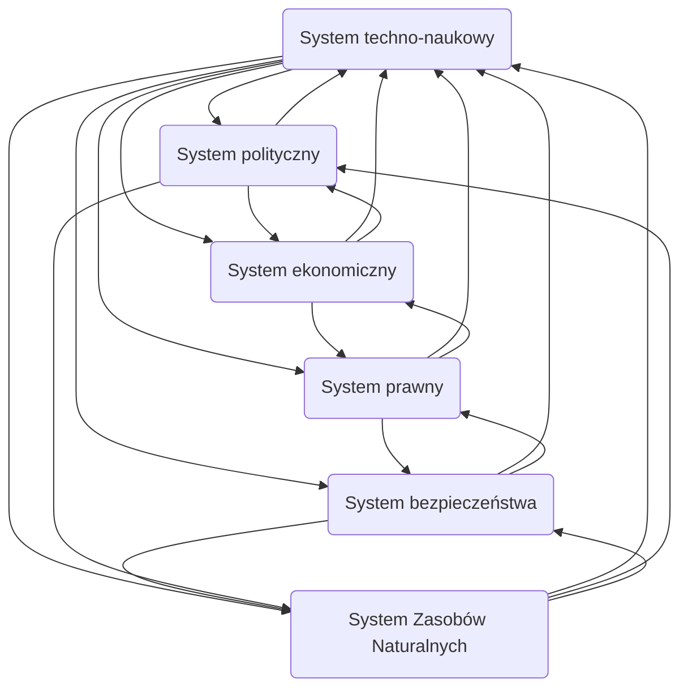

# Pytanie o Technikę

1. Geneza filozofii techniki
2. Ujęcia techniki
3. Determinanty kierunku rozwoju systemu techno-naukowego
4. Problematyka wartościowania techniki/oceny technologii (Technology assesment)
5. Zadania oceny technologii
6. Dlaczego istnieje potrzeba TA
7. Elementy procesu wartościowania techniki (wg A. Kiepasa)
8. Problem ryzyka

## Geneza filozofii techniki
Arystoteles wyróżniał trzy rodzaje aktywności człowieka
 - poznanie - rozum, celem była prawda
 - działanie - rozsądek, celem było dobro
 - wytwarzanie - *techne* celem była rzecz

Zwrot normatywny 60/70 lata w technice
- pojawienie się w świadomości ludzkiej zagrożeń globalnych
- odchodzenie od uznawania neutralności techniki

## Ujęcia techniki

W obrębie studiów nad nauką oraz technologią wyróżnia się trzy aspekty znaczeniowe pojęcia technika:
- artefakty, konkretne przedmioty fizyczne, urządzenia
- proces, działanie
- ludzka wiedza i technika

### Technika jako sprzęt
Rozróżnienie między narzędziem a maszyną, narzędzie człowiek manipuluje a maszyna jest samodzielna do pewnego stopnia
### Technika jako zbiór zasad
Technika obejmuje nie tylko narzędzia i maszyny ale też schematy relacji pomiędzy stosowanymi środkami a wytyczonymi im celami
### Technika jako system
Sprzęt techniczny, ma sens tylko w kontekście zrozumienia i zastosowania, warunkiem przynależności jest umieszczenie go w kontekście użytkowania

