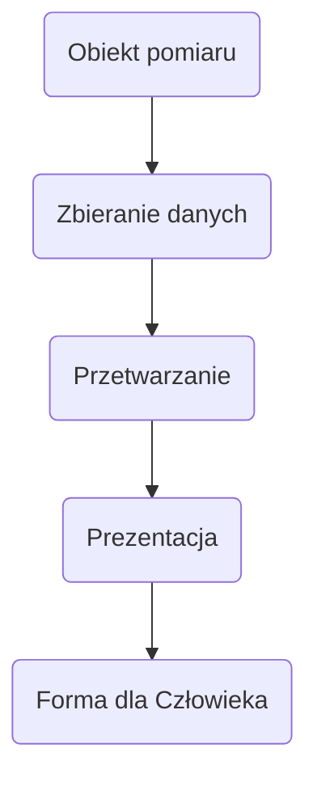
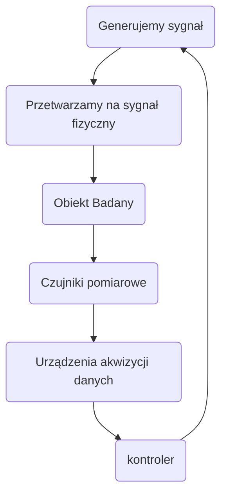

# Systemy Pomiarowe

wymień conajmniej 2 cechy, 4..., abc #kolokwium 

## System

jest to byt przejawiający istnienie przez synergiczne współdziałanie swych części
synergiczność działań - wspólne działanie daje lepsze efekty niż samodzielna praca $2+2>4$

## System pomiarowy

zbiór środków technicznych podporządkowanych wspólnemu celowi i ogólnemu algorytmowi działania

## Komputerowy system pomiarowy
#kolokwium {
- sterowanie przepływem informacji w systemie
- przetwarzanie danych
- wizualizacja
- archiwizacja
}

## Interface

połączenie między rozważanym systemem a innym systemem

- kable
- złącza
- nadajniki i odbiorniki
- funkcje
- linie sygnałowe
- zależności czasowe / zasady sterowania
- konwerter

ma: zasięg, szybkość, dyspersja, tłumienie

#kolokwium {
funkcje:
- przekazywanie sygnałów
- konwersja
- synchronizacja
- obsługa przerwań
- buforowanie
- korekcja błędu
}

### Standard interface
### Magistrala interface

## Interface Pętla prądowa (0)4-20mA
Cechy:
- jednocześnie zasilamy przyrząd i transmisje
- brak wpływu rezystancji linii
- dobra odporność na zakłócenia zewnętrzne
- mały prąd do zasilania
- niestabilność prądu wpływa na błąd
- transmisja 1 wyniku naraz

## Systemy Komputerowe

| Przyczyny                                                                                                               | Korzyści                                                     |
| ----------------------------------------------------------------------------------------------------------------------- | ------------------------------------------------------------ |
| Ograniczone możliwości percepcji i reakcji człowieka przy sterowaniu ręcznym systemem pomiarowym                        | Lepsze wykorzystanie dostępnej informacji o obiekcje         |
| Rosnące wymagania wobec systemów pomiarowych w zakresie: szybkość działania, kosztów realizacji, niezawodność działania | Szybsze działanie przy rosnącej komplikacji systemu          |
|                                                                                                                         | Obniżenie kosztów realizacji pomimo zwiększonej liczby zadań |
|                                                                                                                         | Podwyższanie niezawodności systemów                          |
|                                                                                                                         | mniejsze kości                                               |

## Systemy pomiarowe

OFF-line - wyniki są na bieżąco zapamiętywane
ON-line - wyniki są na bieżąco wykorzystywane

Open loop - wyniki pomiarów są na bieżąco wykorzystane przez personel do ręcznego sterowania obiektem
Closed loop - wyniki pomiarów są na bieżąco wykorzystywane do automatycznego sterowania obiektem oraz dodatkowo prezentowane personelowi

Real Time (czas rzeczywisty) - "przewidywalny" czas pracy niekoniecznie szybki

## Wybór systemu pomiarowego

- obiekt pomiarowy
  - Przeźroczystość
  - Wielkość
  - Kształt
  - Materiał
  - "Przeżycie"
- jednostka skali
- kosztu
- środowiska wykonywania pomiarów
- zastosowania
- prędkość pomiaru

## Karty pomiarowe
karty zaprojektowane tak aby współpracowały z komputerem i tworzyły z nim tzw. wirtualne przyrządy pomiarowe

## Model sprzętowy systemu pomiarowego

## Przyrządy wirtualne
Oprogramowanie wirtualnego przyrządu pomiarowego to zapisany w odpowiednim języku algorytm działania systemu pomiarowego

#kolokwium {
ok 20 pytań
dostaniemy kartki
różne liczby
oczka kirhoffa
przeliczanie niepewności ://
zapisanie w zapisie inżynierskiej
definicja tylko wybór
punkty ujemne ale min 0 punktów
decybele
wymienić z systemów
napisz wzór
}

