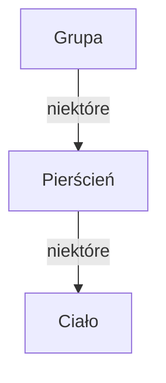

# Wprowadzenie
## Symbole
$\forall_{x \in X}\Phi(x)$ dla każdego x nalerzącego do X zachodzi $\Phi(x)$
$\exists_{x\in X} \Phi(x)$ istnieje takie x nalerzące do X dla którego zachodzi $\Phi(x)$

$N$ - Naturalne
$Z$ - Całkowite
$Q$ - Wymierne
$R$ - Rzeczywiste
$C$ - Zespolone

## Grupa, Pierścień, Ciało

(Q,+,$\times$,0,1) - ciało liczb wymiernych
(N,+,$\times$,0,1) - zbiór liczb naturalnych

naturalne nie są zbiorem ponieważ nie mają $1\over5$ odwrotności 5 i -5 przeciwności 5

$$N\not\subseteq Z\not\subseteq Q\not\subseteq R\not\subseteq C$$

## Definicja i i zapis w formie iloczynu kartezjańskiego
$$x^2+1=0$$
$$x^2=-1$$
$$x=\sqrt{-1}=:i = (0,1)$$
$$i^2=(0,1)\times(0,1)=(-1,0)$$
$$z = a + bi,\qquad a,b\in R, \qquad a=Re(z), \qquad b=Im(z)$$
### Działania
#### Dodawanie
$(2+3i)+(-7+i)=-5+4i$
#### Odejmowanie
$(3-i)-(2+5i)=1-6i$
#### Mnożenie
$(2+3i)\times(2+5i)=2\times1+2i+3i-1+3i\times i = -1+5i$
#### Dzielenie
${{1+3i}\over{2-i}}={{1+3i}\over{2-i}}+{{2+i}\over{2+i}}={{2+i+6i-3}\over{4+1}}={{-1+7i}\over5}={-1\over5}+{7\over5}i$

### Liczby sprzęrzone
Sprzęrzenie odwrócenie znaku przy i
(2,1) i (2,-1) 
$a+bi$ i $a-bi$

$i^{-1}=-i$
$i^3=-i$
$i^4=1$

[Ćwiczenia 1](/Notatki/Semestr%201/Algebra%20liniowa%20z%20geometri%C4%85%20analityczn%C4%85/%C4%86wiczenia/%C4%86wiczenia%201/%C4%86wiczenia%201.md)[Ćwiczenia 2](/Notatki/Semestr%201/Algebra%20liniowa%20z%20geometri%C4%85%20analityczn%C4%85/%C4%86wiczenia/%C4%86wiczenia%202/%C4%86wiczenia%202.md)