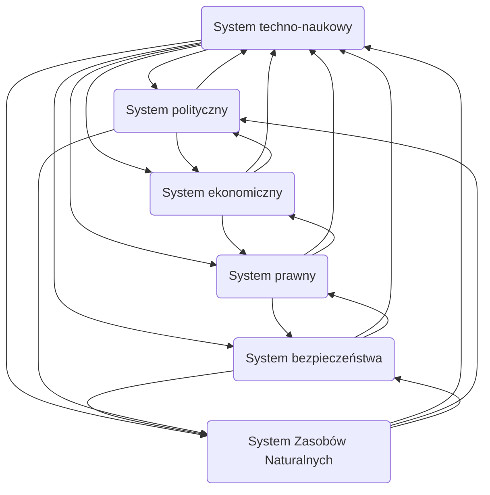

# Pytanie o Technikę

1. Geneza filozofii techniki
2. Ujęcia techniki
3. Determinanty kierunku rozwoju systemu techno-naukowego
4. Problematyka wartościowania techniki/oceny technologii (Technology assesment)
5. Zadania oceny technologii
6. Dlaczego istnieje potrzeba TA
7. Elementy procesu wartościowania techniki (wg A. Kiepasa)
8. Problem ryzyka

## Geneza filozofii techniki
Arystoteles wyróżniał trzy rodzaje aktywności człowieka
 - poznanie - rozum, celem była prawda
 - działanie - rozsądek, celem było dobro
 - wytwarzanie - *techne* celem była rzecz

Zwrot normatywny 60/70 lata w technice
- pojawienie się w świadomości ludzkiej zagrożeń globalnych
- odchodzenie od uznawania neutralności techniki

## Ujęcia techniki

W obrębie studiów nad nauką oraz technologią wyróżnia się trzy aspekty znaczeniowe pojęcia technika:
- artefakty, konkretne przedmioty fizyczne, urządzenia
- proces, działanie
- ludzka wiedza i technika

### Technika jako sprzęt
Rozróżnienie między narzędziem a maszyną, narzędzie człowiek manipuluje a maszyna jest samodzielna do pewnego stopnia
### Technika jako zbiór zasad
Technika obejmuje nie tylko narzędzia i maszyny ale też schematy relacji pomiędzy stosowanymi środkami a wytyczonymi im celami
### Technika jako system
Sprzęt techniczny, ma sens tylko w kontekście zrozumienia i zastosowania, warunkiem przynależności jest umieszczenie go w kontekście użytkowania

## Technology assessment

### Zadania oceny technologii
1. Budowa odpowiedniej kompetencji doradczej
2. Koncentracja informacji przydatnych w parlamentarnych procesach decyzyjnych w kwestiach rozwoju naukowo-technologicznego
3. Wczesne rozpoznawanie i ostrzeganie
4. Wypracowanie strategii wyprzedzającego rozwiązania dających się przewidzieć problemów towarzyszących rozwojowi nauki i technologii
5. Odbudowa zaufania społecznego w prawomocność decyzji politycznych wyznaczających kierunki tego rozwoju

### Cele modeli oceny technologii:
1. Analiza stanu techniki/technologii i jej możliwości rozwojowych
2. ocena na drodze prognozowania bezpośrednich, pośrednich, ubocznych i rozłożonych w czasie skudów danej techniki/technologii oraz rozwiązań wobec niej alternatywy
3. Bilansowanie różnorodnych następstw techniki/technologii i jej rozwoju w celu eliminowania jej negatywnych i wykorzystywania pozytywnych możliwości

### Elementy procesu wartościowania techniki
1. Ustalamy problem
2. Opisujemy technologie i alternatywy
3. Prognozujemy gdzie będzie zastosowana i jej wpływ na system
4. Identyfikujemy grupy społeczne zainteresowanie rozwojem tej technologii i wpływ na nią
5. Identyfikacja czynników i źródeł oporu związanych z systemem
6. Prognozujemy społecznie - zmiana techniczna -> zmiana społeczna
7. Identyfikacja skutków
8. Analiza skutków 
9. Ocena skutków
10. Analiza polityki/strategii
11. Komunikacja rezultatów

## Problem ryzyka

### Obszary ryzyka związanego z wdrażaniem nowych technologii
1. zagrożenie ekologiczne
2. ryzyko zagrożenia zdrowia populacji
3. katastrofy technologiczne
4. Broń masowego rażenia
5. Terroryzm
6. Zagrożenie bezrobociem na rynku pracy
7. Chwiejność systemów emerytalnych
8. Presja migracyjna i bezwzględność kapitału
9. Wzrost nierówności społecznych
10. Bogacenie się koncernów i spekulacje finansowe destabilizujące rynki lokalne

### Determinizm techniczny w wersji komunikacyjnej
Charakter kultury zależy od głównej technologii tj: od tego na czym jest przekazywana informacja
1. Determinizm techniczny "twardy"
   Środek komunikacji bezpośrednio wpływają na zmiany społeczne
2. Determinizm techniczny "miękki"
   Technologie nie są aż tak bardzo autonomiczne

