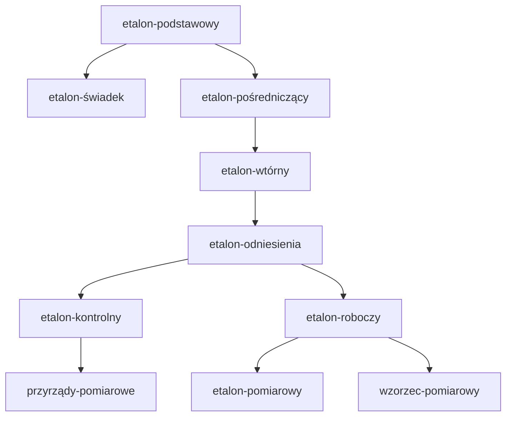
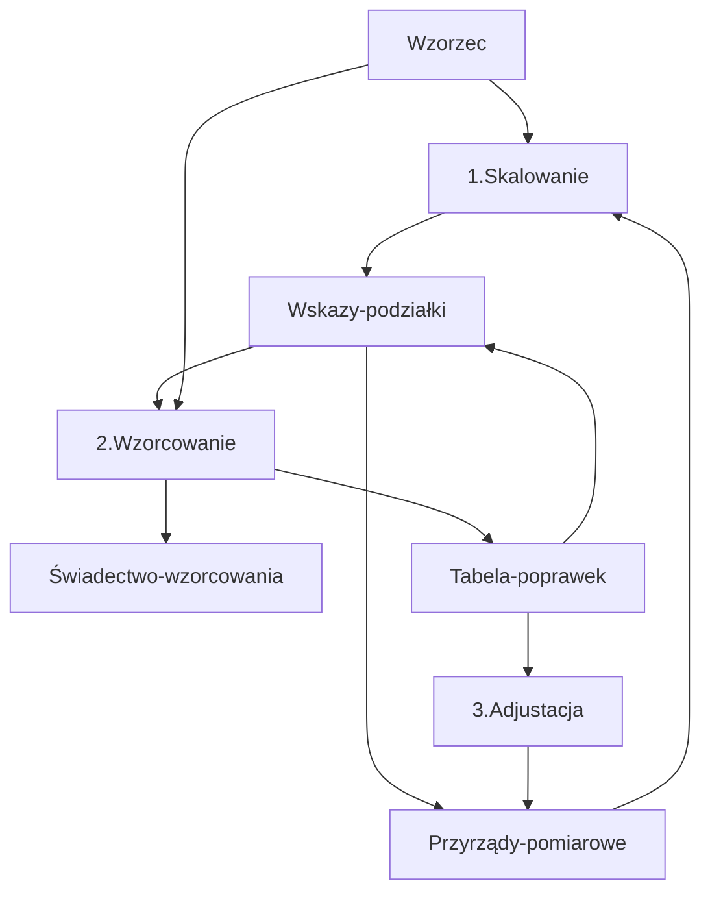

 hasło: PB_W1
# Wprowadzenie do miernictwa

## Proces poznania rzeczywistości
### Postrzeganie
elementarne
### Obserwacja
celowo, zaplanowane
### Eksperyment
zabieg w celu uzyskania informacji(liczba + jednostka)
- jakościowy:
  jakie to jest
- ilościowy:
  ile tego jest

## Wielkość a wartość
- Wielkość: cecha którą można wyznaczyć jakościowo i ilościowo np. napięcie, mogą być skalarne i wektorowe(szybkość i prędkość),
- Wartość: ilościowe wyrażenie wielkości(opisuje wielkość) np. 5mV,

## Pomiar
- Proces doświadczalnego wyznaczenia jednej lub więcej wartości wielkości, w zasadny sposób przyporządkowane
- czynności po których wykonaniu możemy stwierdzić ze w chwili pomiaru dokonanego w określonych warunkach, przy zastosowaniu określonych środków i wykonaniu odpowiednich czynności wielkość mierzona x miała wartość
   $a\leq x\leq b$<- wynik pomiarowy 
  (określone czynności, właściwy dla chwili, zależy od narzędzi, jak go wykonać, wynik)

## Wynik
- wynikiem jest wartość opisującą ilościowo mierzoną wielkość, przedzia w którzym znajduje się wielkość prawdziwa
- wynikiem jest liczba i jednostka
- wynikiem jest przedział np. 5.00V $\pm$ 0,10V (wartość $\pm$ niepewność)
- jest niedokłądny, niepowtarzalny. sam pomiar można powtórzyć

## Pojęcia związane
### Dokładność
- miara określająca dopuszczalną różnicę między wartością zmierzoną a wartością prawdziwą
### Precyzja
- określa przewidywalny rozrzut wielokrotnych wyników tego samego obiektu, precyzyjne powinny dawać bardzo zbliżony wynik
### Rozdzielczość
- minimalna mierzalna zmiana wyniku pomiaru, "ziarno" wskazania miernika 1 $\degree C$ a 0,1 $\degree C$
## Czułość
- bardziej reaguje na zmiany

## Cechy wyniku pomiaru
- wiarygodny i miarodajny
- użyteczny do określonego celu
- powinien mieć oszacowaną niepewność/błąd, adekwatna do potrzeb
- przeanalizowany przed uznaniem go za właściwy, nigdy nie wierz pojedyńczemu pomiarowi.

## Jednostka miary:
wielkość określona zdefiniowana jednoznacznie
- jednoznacznie zdefiniowana
- nadaną nazwe np. wolt
- mieć oznaczenie
- uporządkowane

## Układ jednostek miar
- uporządkowany zbiór jednostek miar wielkości podstawowych i pochodnych
- wielkości podstawowe są to wielkości uznawane jako niezależne w danym ukłądzie i za ich pomocą definiuje się wielkości pochodne
- wielkości pochodne to wielkości zdefiniowane przez funkcje / zależności wielkości pochodnych np 1/V

## Jednostki miary (podstawowe) - SI
- kilogram
- metr
- sekunda
- amper
- kelwin
- mol
- kandel

## Wielokrotności i pod wielkości  #kolokwium
- tera - T - $10^{12}$
- giga - G - $10^9$
- mega - M - $10^6$
- kilo - k - $10^3$
- mili - m - $10^{-3}$
- mikro - $\mu$ - $10^{-6}$
- nano - n - $10^{-9}$
- piko - p - $10^{-12}$
- femto - f - $10^{-15}$
- atto - a - $10^{-18}$

## Spójność pomiarowa
### Wzorce miar
układy przeznaczone do odtwarzania lub zachowania czy realizacji jednostki miary lub jej wielokrotność. Mają swoją hierarchię i są ze sobąpowiązane przez nieprzerwany ciąg porównań.
### Spójność pomiarowa

## Wzorcowanie, skalowanie, adjustacja
- Wzorcowanie / kalibracja: określanie niepewności wzorcowania -rzez podównanie wskazania miernika wzorcowego do wzorcowanego 

## Metrologia prawna
dopuszczenie określonych urządzeńdo obiegu
- zatwierdzenie typu - że spełnia wymagania
- legalizacja/uwierzytelnienie - sprawdzenie, stwierdzenie i poświadczenie dowodem legalizacji że przyrząd pomiarowy spełnia kryteria
- wzorcowanie

