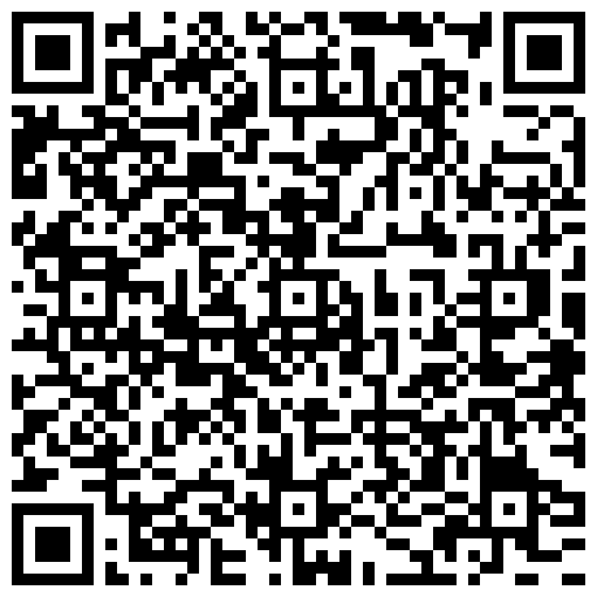

# Introduction

# Selected academic papers

[AI reads text from ancient Herculaneum scroll for the first time](/Notatki/Semestr%203/Język%20angielski%20-%20C1.1/Ćwiczenia/Portfolio/The%20Elder%20Scrolls/AI%20reads%20text%20from%20ancient%20Herculaneum%20scroll%20for%20the%20first%20time.md) - Describes the breakthrough in reading unreadable papyrus by the AI algorithm created by CS students.

---

[From damage to discovery via virtual unwrapping](/Notatki/Semestr%203/Język%20angielski%20-%20C1.1/Ćwiczenia/Portfolio/The%20Elder%20Scrolls/From%20damage%20to%20discovery%20via%20virtual%20unwrapping.md) - In dept knowledge about what was done to be able to read scrolls without destroying them. Provides explanation about how to prepare the data so that it would be possible to read it by AI. It also describes details about the pipeline and each processes that the scrolls went through.